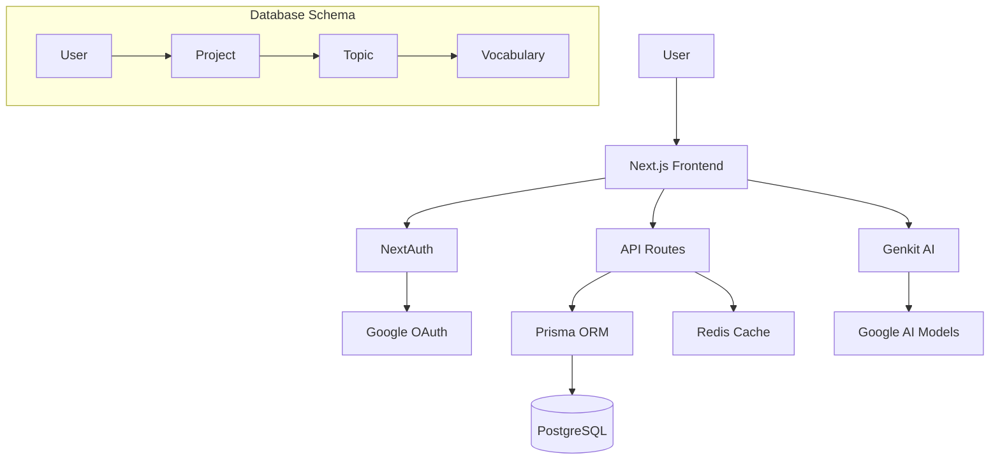

# System Analysis: Crispy Flash (Flashcard Learning System)

## 1. Overview

This is a flashcard learning system designed for vocabulary learning, particularly Japanese (Kanji, Hiragana, Katakana). The system allows users to create projects, organize topics, import vocabulary, and learn using interactive flashcards with progress tracking.

## 2. Tech Stack

### Frontend
- **Next.js 15.3.3**: React framework with App Router, TypeScript support
- **React 18.3.1**: UI library
- **TypeScript 5.9.2**: Type safety
- **Tailwind CSS 3.4.1**: Utility-first CSS framework
- **Radix UI**: Accessible UI components (accordion, dialog, etc.)
- **Framer Motion 11.2.12**: Animation library for flashcard interactions
- **Lucide React**: Icon library
- **React Hook Form + Zod**: Form handling and validation

### Backend
- **Next.js API Routes**: Server-side API endpoints
- **Prisma 6.16.2**: ORM for database interactions
- **PostgreSQL**: Primary database (via Supabase)
- **NextAuth 4.24.11**: Authentication (Google OAuth)
- **Redis (Upstash)**: Optional caching layer

### AI Integration
- **Genkit AI**: Google AI integration for potential vocabulary enhancement
- **@genkit-ai/googleai**: Google AI models

### Development & Deployment
- **Turbopack**: Fast bundler for development
- **Vercel Analytics & Speed Insights**: Performance monitoring
- **ESLint & TypeScript**: Code quality tools

### Configuration
- **next.config.ts**: Allows remote images from Unsplash, Picsum, Placehold.co
- **Build settings**: Ignores TypeScript and ESLint errors during build (potential issue)

## 3. System Functions

### Core Entities
- **User**: Authenticated via Google OAuth
- **Project**: Top-level container (e.g., "Japanese N5 Vocabulary")
- **Topic**: Sub-container within projects (e.g., "Greetings")
- **Vocabulary**: Individual words with Kanji, Kana, Meaning, Image, Type (1=simple, 2=grouped)

### Key Features
1. **Authentication**: Google OAuth login
2. **Project Management**: CRUD operations on projects
3. **Topic Management**: CRUD operations on topics within projects
4. **Vocabulary Import**: Text-based import with column mapping preview
5. **Flashcard Learning**:
   - Randomized card order
   - Flip between Kanji/Meaning views
   - Mark as Remembered/Not Remembered
   - Filter to review only "not remembered" cards
   - Progress tracking and summary
6. **Caching**: Redis-based caching for performance (optional)

### User Flow
1. User signs in with Google
2. Creates projects to organize learning
3. Adds topics within projects
4. Imports vocabulary via textarea input
5. Previews and maps columns (Kanji, Kana, Meaning)
6. Learns using flashcards, marking progress
7. Reviews progress and focuses on difficult words

## 4. Database Schema

```prisma
model User {
  id        String   @id @default(cuid())
  email     String   @unique
  name      String?
  projects  Project[]
}

model Project {
  id          String    @id @default(cuid())
  title       String
  description String?
  ownerId     String
  owner       User      @relation(fields: [ownerId], references: [id])
  topics      Topic[]
}

model Topic {
  id        String      @id @default(cuid())
  title     String
  projectId String
  project   Project     @relation(fields: [projectId], references: [id])
  vocabulary Vocabulary[]
}

model Vocabulary {
  id        String   @id @default(cuid())
  kanji     String?
  kana      String?
  meaning   String
  image     String?
  type      Int      @default(1)  // 1=simple word, 2=grouped by Kanji
  status    String   @default("unknown")  // learning status
  topicId   String
  topic     Topic    @relation(fields: [topicId], references: [id])
}
```

## 5. Issues Identified

### Critical Issues
1. **Learning Progress Not Persisted**: In `LearningSession.tsx`, marking cards as "remembered" or "not remembered" is UI-only. The status is not saved to the database, making progress tracking ineffective.

2. **Build Error Suppression**: `next.config.ts` has `ignoreBuildErrors: true` and `ignoreDuringBuilds: true`, which can hide real TypeScript and ESLint errors, potentially leading to runtime issues.

### Performance Issues
3. **Optional Redis Caching**: Caching is implemented but Redis is optional. Without Redis, performance may degrade with database load.

4. **No Database Indexes on Status**: Vocabulary status queries may be slow without proper indexing.

### Code Quality Issues
5. **Limited Error Handling**: API routes have basic error handling but could be more robust.

6. **No Tests**: No visible test files or testing framework configured.

7. **Hardcoded Values**: Some configurations (like allowed origins) are hardcoded.

## 6. Improvement Suggestions

### High Priority
1. **Implement Persistent Learning Progress**:
   - Add API endpoint to update vocabulary status
   - Modify `LearningSession` to persist changes to database
   - Add proper state management for learning sessions

2. **Enable Build Error Checking**:
   - Remove `ignoreBuildErrors` and `ignoreDuringBuilds` from `next.config.ts`
   - Fix any revealed TypeScript/ESLint errors

3. **Add Database Indexes**:
   - Index on `Vocabulary.status` for efficient filtering
   - Consider composite indexes for common queries

### Medium Priority
4. **Enhanced Error Handling**:
   - Add comprehensive error boundaries in React components
   - Implement proper error responses in API routes
   - Add logging for debugging

5. **Implement Spaced Repetition Algorithm**:
   - Add fields for review intervals, ease factor, etc.
   - Schedule cards based on forgetting curves
   - Improve long-term retention

6. **Add Testing Framework**:
   - Set up Jest/Vitest for unit tests
   - Add integration tests for API routes
   - Implement E2E tests with Playwright

### Low Priority
7. **Performance Optimizations**:
   - Implement proper caching strategies
   - Add pagination for large vocabulary lists
   - Optimize database queries with select fields

8. **Feature Enhancements**:
   - Export vocabulary as CSV/Excel
   - Multi-language support
   - Gamification (badges, streaks)
   - Mobile app version

9. **Security Improvements**:
   - Add rate limiting to API endpoints
   - Implement proper input sanitization
   - Add CSRF protection

10. **UI/UX Improvements**:
    - Add dark mode toggle (already has theme support)
    - Improve accessibility
    - Add keyboard shortcuts for flashcards
    - Implement offline mode

## 7. Architecture Diagram



## 8. Conclusion

The system has a solid foundation with modern tech stack and clear architecture. The main issues revolve around incomplete learning progress persistence and suppressed error checking. Addressing these high-priority items will significantly improve the system's reliability and user experience. The suggested improvements provide a roadmap for enhancing performance, maintainability, and feature richness.