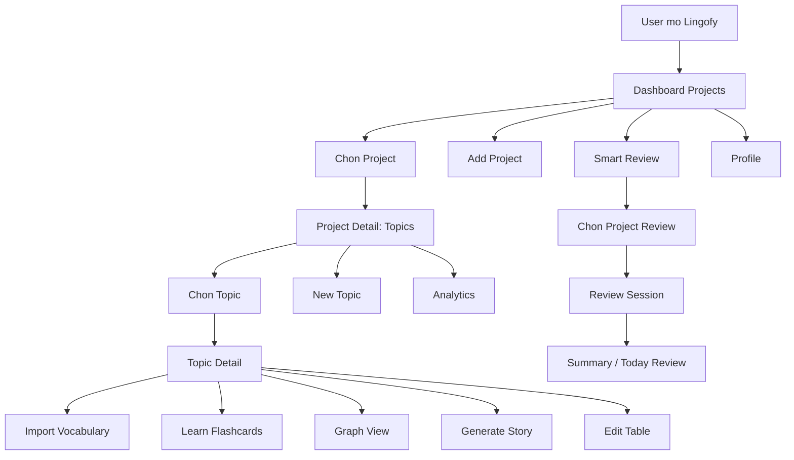
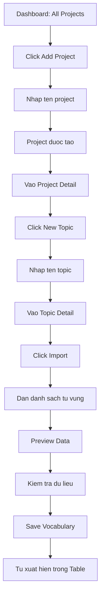
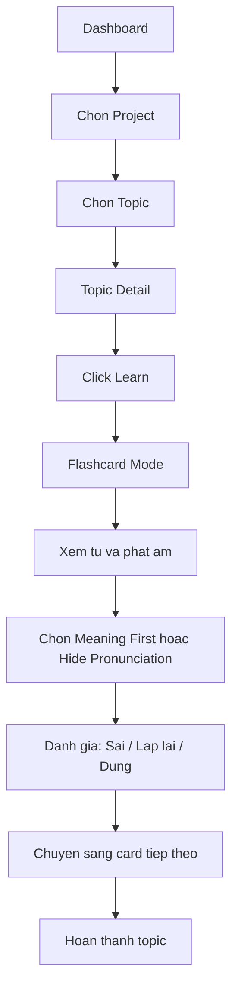
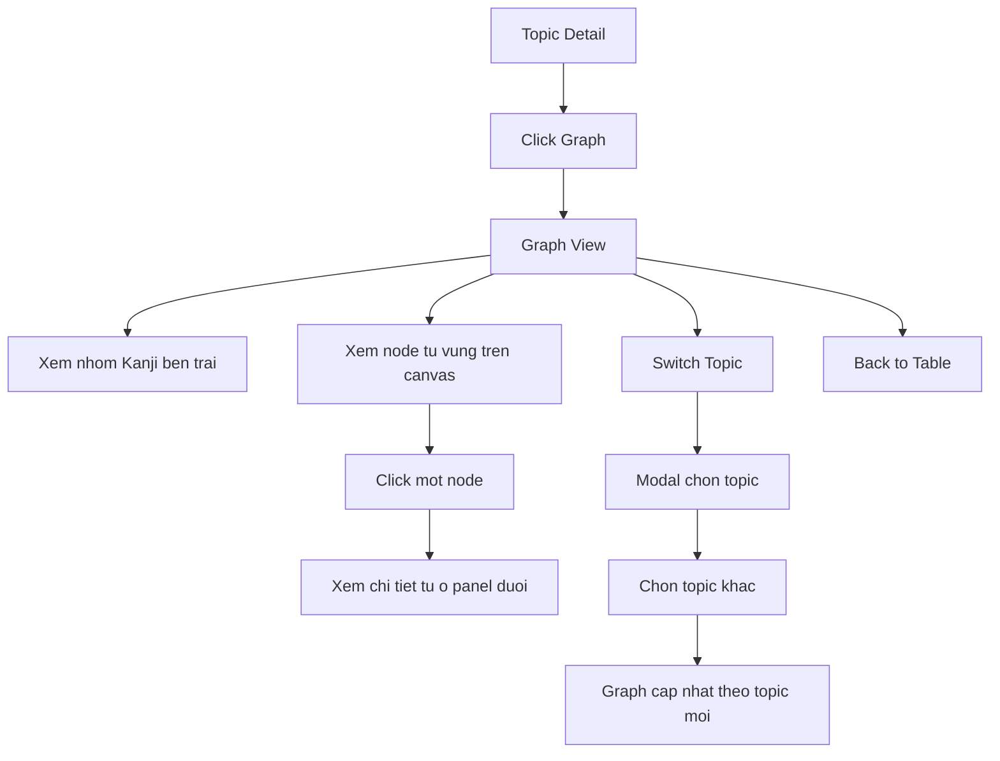
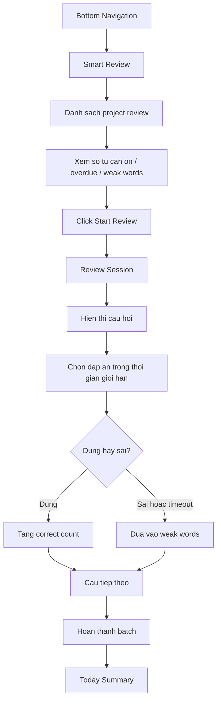
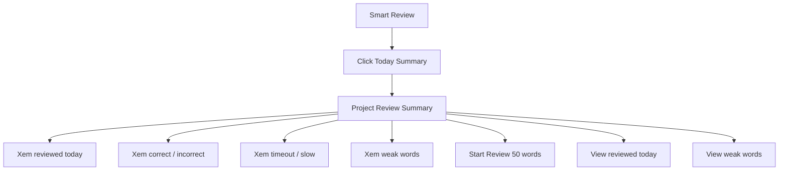
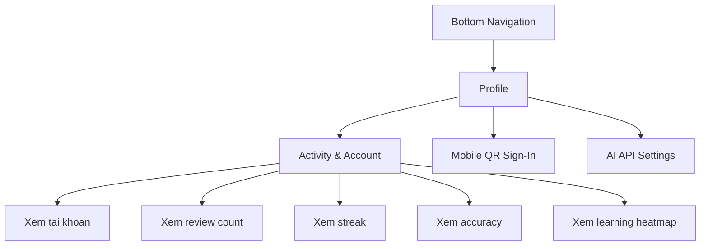

# Lingofy Usage Flow

Tai lieu nay mo ta usage flow chinh cua website Lingofy dua tren cac man hinh UI hien co.

## 1. Flow Tong Quan



## 2. Flow Tao Va Quan Ly Tu Vung



Format import goi y:

```text
日 にち / ひ Ngay, mat troi noun
月 つき / がつ Mat trang, thang noun
```

Muc tieu cua flow nay la giup user nhanh chong tao bo tu vung co cau truc: project, topic, vocabulary list.

## 3. Flow Hoc Theo Topic



Muc tieu cua flow nay la cho phep user hoc tung topic bang flashcard va tu danh dau muc do nho tu.

## 4. Flow Xem Tu Vung Dang Graph



Muc tieu cua flow nay la giup user nhin moi quan he giua Kanji, tu ghep, phat am va nghia theo dang ban do truc quan.

## 5. Flow Smart Review



Review session hien tai gom:

- Cau hoi dang chon nghia dung.
- Thanh tien do, vi du `1 / 50`.
- Dong ho dem nguoc.
- Thong tin lan review gan nhat.
- Nut `Stop` de dung phien on.

## 6. Flow Xem Tong Ket Review



Muc tieu cua flow nay la giup user biet hom nay da on bao nhieu, dung bao nhieu, sai bao nhieu va nhung tu nao can chu y lai.

## 7. Flow Profile / Account



Muc tieu cua flow nay la giup user theo doi lich su hoc tap, do chinh xac, streak va cau hinh tai khoan.

## 8. User Journey Chinh

Mot user dien hinh se dung Lingofy theo thu tu:

1. Vao `Dashboard` de xem toan bo project hoc tu vung.
2. Chon mot `Project`, vi du `Kanji N3`.
3. Tao hoac chon mot `Topic`.
4. Import danh sach tu vung vao topic.
5. Hoc tu bang `Table`, `Flashcard`, hoac `Graph`.
6. Sau khi hoc, vao `Smart Review` de on lai theo thuat toan.
7. Xem `Today Summary` de biet tien do trong ngay.
8. Vao `Profile` de theo doi streak, accuracy va learning heatmap.

## 9. Cac Flow Nen Uu Tien Khi Lam UX

- Onboarding flow: tao project -> tao topic -> import vocabulary -> hoc lan dau.
- Daily review flow: mo app -> Smart Review -> Start Review -> xem summary.
- Topic learning flow: project -> topic -> table / graph / learn.
- Progress tracking flow: Smart Review summary + Profile heatmap.
- Topic switching flow: graph view -> switch topic -> chon topic moi.

## 10. Mo Hinh Su Dung Cot Loi

Lingofy co 3 vong lap chinh:

1. To chuc tu vung: Project -> Topic -> Vocabulary.
2. Hoc theo topic: Table -> Flashcard -> Graph.
3. On tap thong minh hang ngay: Smart Review -> Review Session -> Summary -> Weak Words.

